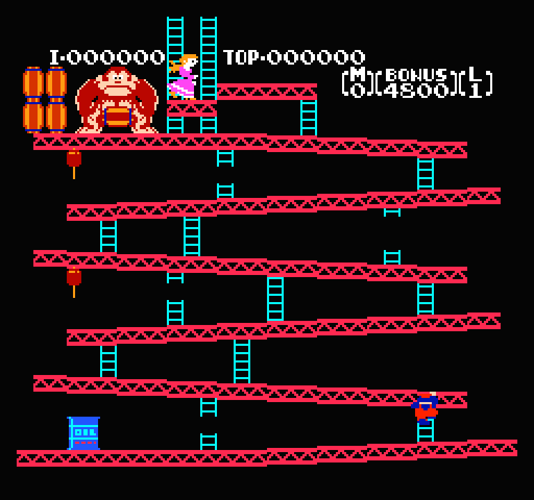

# rust-nes-emulator
For fun NES emulator written in Rust. Currently working on scrolling and sound functionality. 

I took a lot of guidance from [bugzmanov's book](https://bugzmanov.github.io/nes_ebook/chapter_1.html), mostly in the PPU rendering.

This emulator can run most first-gen NES games (games without scrolling, games that don't use unofficial opcodes). 

To use this emulator, clone the repository and run
```
cargo run {nes_file_path}
```
in the top-most directory.

## Control mappings
| Keyboard | Controller |
| -------- | ------- |
| A | A |
| B | B |
| Q | Select |
| W | Start |
| Up | Up |
| Down | Down |
| Left | Left |
| Right | Right |

## Examples
